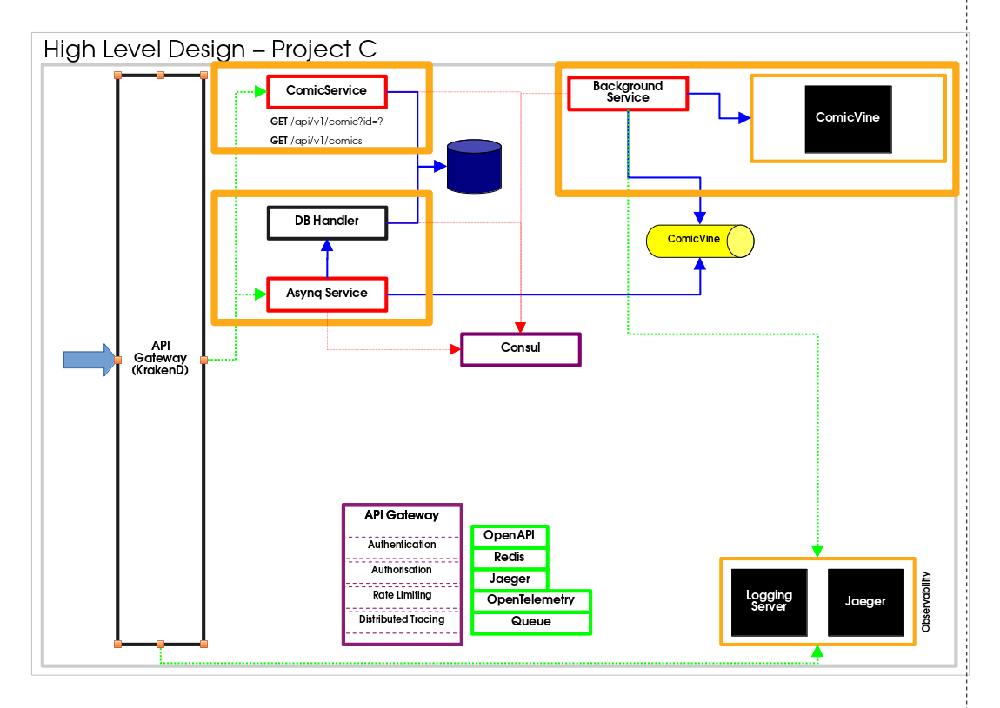

### Project Objective

"This project serves as an exploration into developing distributed applications using the Go programming language. 
Another objective is to make use of system tools written in Go to make it easy to maintain, as we will utilize a single 
programming language. The primary objective of this endeavor is to harness the power of an API gateway to handle 
various aspects of infrastructure - routing, security, others."

Throughout the project, several cutting-edge technologies will be employed to address distributed computing challenges, 
such as asynchronous communication, service resolution, caching, and more.

The codebase places a strong emphasis on executing essential functions, while the complex work of managing 
infrastructure is delegated to the API gateway. The application's purpose revolves around processing data from 
Comicvine, storing it in a database, and implementing caching mechanisms to bolster performance. 
There remains a substantial amount of work to be done in order to fully demonstrate the capabilities of the gateway, 
in conjunction with the use of Dapr, a valuable auxiliary tool. Furthermore, the integration of 
[Dapr](https://github.com/dapr/dapr) will streamline the deployment of the application across various cloud providers,
offering a host of additional advantages.

It's worth noting that this project leverages the [KrakenD project](https://github.com/krakend/krakend-ce) 
for its endeavors.

### Architecture




### Installing and Running

* Register in https://comicvine.gamespot.com/api/ to register and get an API key.

* Run rabbitmq

```
docker run -p 5672:5672 -p 15672:15672 datamanipulation/rabbitmq:3.11-management-alpine
```

* Run krakend-ce from inside `comics` directory:

```
krakend run -d -c gateway/comic.json
```

* Run `main.go`

```
go run main.go -token=<comicvine_token>
```

The parameter `-token` contains the Comicview API key. The application will run in a loop 3 times, each time will obtain 
10 records, with the records pushed to the RabbitMQ queue - `producer-q-exchange`.


### Accessing endpoint

The endpoint `/comic` is exposed by the KrakenD gateway, which can be accessed using cURL:

```
curl http://localhost:8080/comic |  jq . 
```
